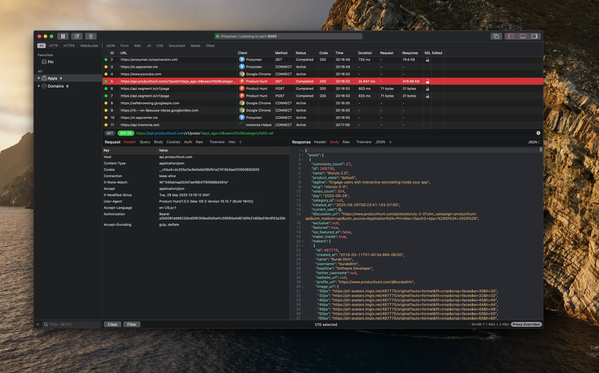

## [Boop](https://boop.okat.best)
A handy scriptable scratchpad to transform plain text using basic operations such as JSON formatting, unescaping, base 64 encoding, etc. Functionality can be extended with a super simple JavaScript API or [additional](https://github.com/IvanMathy/Boop/tree/main/Scripts) scripts suggested by the community. App is free and open source.

?> [DevUtils](https://devutils.app/) is a paid alternative with a bit different set of tools, but native macOS UI.

## ipsm.io
[ipsm.io](https://ipsm.io/) has several APIs to generate dummy placeholder content. Text API is for placeholder texts of different sizes that you can use to test the layout. The next two APIs will generate custom color dummy images and videos that you can use until the real content arrives (download or embed via API).

## [Lorem Picsum](https://picsum.photos/)
The Lorem Ipsum for photos only. The service has a flexible API that helps to generate images of different sizes, greyscale or blurred images, random or [specific](https://picsum.photos/images).
Below is an example for a square greyscale and blurred image (amount of blur is adjustable):
```
https://picsum.photos/200?grayscale&blur=2
```

## [Proxyman](https://proxyman.io/)
A native macOS debugger tool. It allows developers to capture, inspect and manipulate HTTP(s) requests/responses. Main features:
- SSL proxying, including mobile devices and emulators
- mapping content of local files as a response to your requests
- stopping requests with breakpoint tool
- throttling network connection
- WebSocket debugging. For iOS as well using [Atlantis](https://docs.proxyman.io/atlantis/atlantis-for-ios) framework

Proxyman for iOS is also available, making it easy to capture all network traffic from your iOS devices without a desktop companion app.  
Needless to say that Proxyman is built by a very responsive and open to features requests indie developer.


